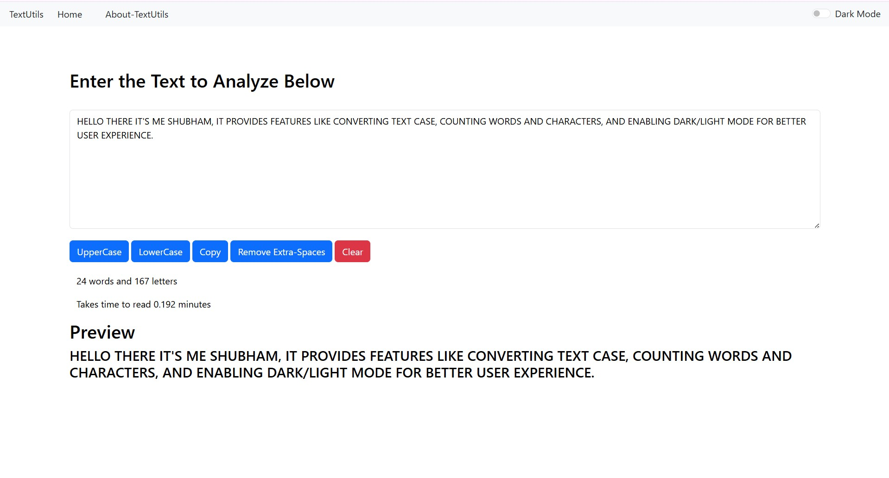
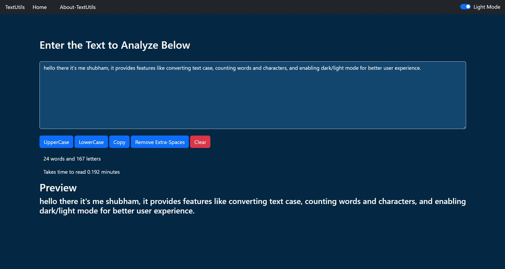

# 📝 TextUtils

TextUtils is a simple and powerful React-based web application that allows users to manipulate and analyze text efficiently. It provides features like converting text case, counting words and characters, and enabling dark/light mode for better user experience.

---

## 🚀 Features

* 🔠 Convert text to **Uppercase**
* 🔡 Convert text to **Lowercase**
* 🧹 Clear text instantly
* 📊 Word and character count
* ⏱️ Estimated reading time
* 🌙 Toggle between **Dark Mode** and **Light Mode**
* 🔔 Alert notifications for user actions
* 📄 Multi-page navigation using React Router

---

## 🛠️ Tech Stack

* ⚛️ React.js
* 🧭 React Router DOM
* 🎨 Bootstrap (for styling)
* 💡 JavaScript (ES6)

---

## 📂 Project Structure

```
TextUtils/
│── public/
│── src/
│   ├── components/
│   │   ├── Navbar.js
│   │   ├── TextForm.js
│   │   ├── About.js
│   │   └── Alert.js
│   ├── App.js
│   └── index.js
```

---

## ⚙️ Installation & Setup

Follow these steps to run the project locally:

```bash
# Clone the repository
git clone https://github.com/your-username/textutils.git

# Navigate into the project folder
cd textutils

# Install dependencies
npm install

# Start the development server
npm start
```

---

## 📸 Screenshots

### White Mode


### Dark Mode


---

## 🌐 Usage

1. Enter your text in the input box
2. Choose an action (uppercase, lowercase, clear, etc.)
3. View instant results and analysis

---

## 🌙 Dark Mode

Toggle between dark and light themes using the switch in the navbar for a better viewing experience.

---

## 🔮 Future Improvements

* ✨ Add more text formatting tools
* 🌍 Language translation feature
* 💾 Save text functionality
* 📱 Improve mobile responsiveness

---

## 🤝 Contributing

Contributions are welcome!

1. Fork the repository
2. Create a new branch
3. Make your changes
4. Submit a pull request

---

## 🙌 Acknowledgements

* Inspired by basic text utility tools
* Built as a React learning project

---

## 👨‍💻 Author

**Shubham Rajay sarate**
GitHub: https://github.com/shubham-sarate

---
